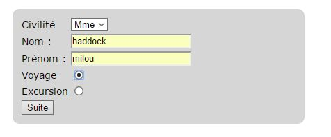
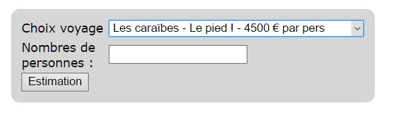
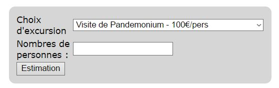
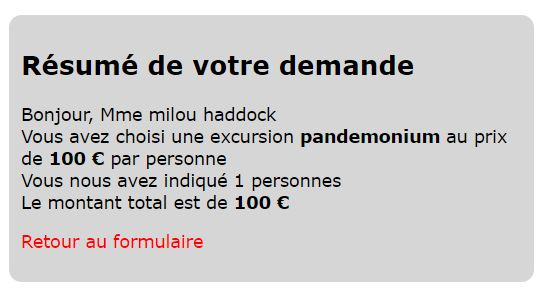

# Agence de voyage

## Objectif

A partir de tout ce que vous avez vu depuis le début de la formation (HTML, CSS, Bootstrap, PHP), créez un mini site d'agence de voyage.

## Consignes :
Créez obligatoirement un formulaire selon le modèle ci-joint (nom de la page : **formulaire.php**)

Selon le choix (voyage ou excursion), vous êtes dirigés vers une seule page (**agence.php**) qui vous propose 2 voyages possibles (voyages au choix avec un prix) ou deux excursions (au choix avec un prix).

**Voyage**

**Excursion**

Enfin cette page transfère et fait le récapitulatif (**recapitulatif.php**) des choix faits ainsi que le montant total en fonction du nombre de personnes.

**Récapitulatif**

## Hosting
Vous pouvez uploadez votre site avec GitHub page, plus d'info ici :

https://pages.github.com/
